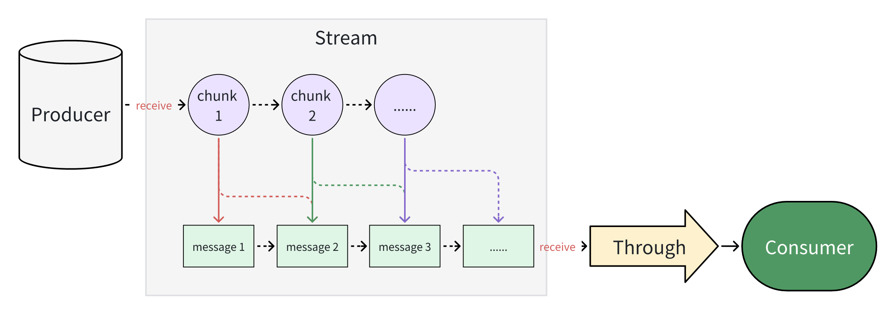

# Lite SSE(sever send event) Chunk

a lite tool to parse sse chunk.



```text
< chunk1 start
data: hello

data: world!

data: this is
< chunk1 end

==> messages : ['hello', 'world!']

< chunk2 start
last!

< chunk2 end

===> messages : ['this is last!']
```

## Usage

### basic

```javascript
const { TextStream } = require('lite-sse-chunk');
const stream = new TextStream();
stream.addChunkListener((messages) => {
    console.log(messages); // the messages of newest chunk
    console.log(Array.isArray(messages)); // always true!
});

theSource.on('chunk', (chunk) => {
    const text = decodeText(chunk); // decode the chunk to text if the chunk is binary
    stream.receive(chunk);
});
```

### custom chunk read

```javascript
const { TextStream, createRegexExtractor } = require('lite-sse-chunk');
const reader = createParser(/xxxx: (.*)\n\n/g);
const stream = new TextStream(reader);
stream.addChunkListener((messages) => {
    console.log(messages); // the messages of newest chunk
    console.log(Array.isArray(messages)); // always true!
});

theSource.on('chunk', (chunk) => {
    const text = decodeText(chunk); // decode the chunk to text if the chunk is binary
    stream.receive(text);
});
```

the result:

```text
< chunk1 start
xxxx: hello

xxxx: world!

< chunk1 end

==> messages : ['hello', 'world!']
```

## ChangeLog

### 0.0.2
- dependency fix;


### 0.0.1

- first release
- support text parse
